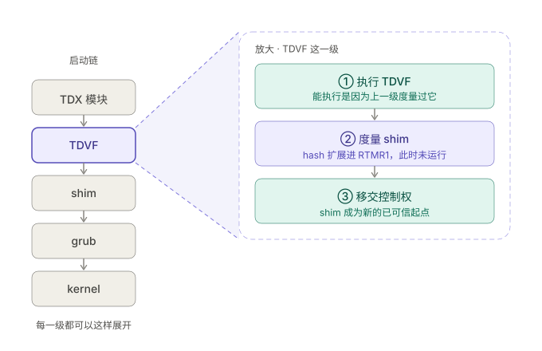
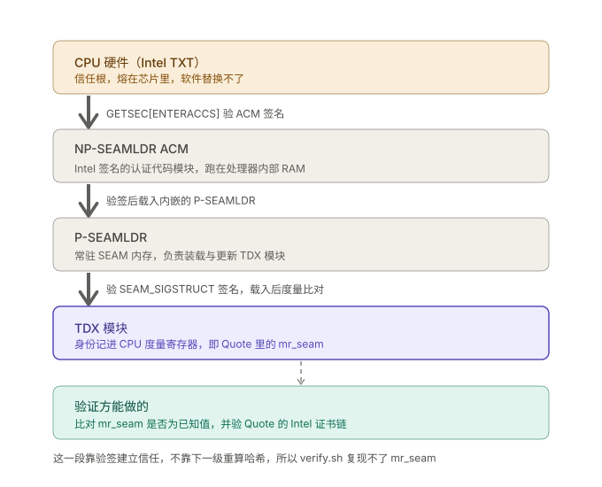

# zeroseal-verifier

ZeroSeal 的 TDX 远程证明验证器 / A verifier for ZeroSeal's TDX remote attestation.

[中文](#中文) · [English](#english)

---

## 中文

### 这是什么

这个仓库包含一个 shell 脚本与脚本所用的一切配方，旨在让验证方在不需要信任，即零信任下确认 zeroseal 提供的中转服务正在运行的是 [zeroseal-gateway 这套程序（以下简称 gateway）](https://github.com/Falicitas/zeroseal-gateway)，以及确认运行程序的完整 Linux OS。在你的 Linux 环境下运行 `./verify.sh`，将生成一个崭新的未挂载的 Linux OS，这个 OS 涵盖 RPg。最后我们利用可信执行环境（TEE）的能力，在零信任下让验证方确认 zeroseal 目前对外提供的服务的运行中的 OS 正是验证方自己独立手动生成的 OS。

### 构建环境

你的 Linux 环境不需要使用 TDX 硬件。具体参考环境如下：

- Ubuntu 24.04 LTS（noble）
- （必须）x86_64
- 干净容器。PATH 里若有自己编的 mkosi 或 ukify 会被优先取用，大概率会算出不一样的结果
- 20 GB 空闲磁盘。tools 树解开 1.3 GB，mkosi 产出的 rootfs、erofs、verity 合计约 2 GB，Go 工具链与编译缓存占 1 GB
- 2 vCPU / 4 GB 内存
- 网络环境能连 Ubuntu 官方源与 snapshot 服务、GitHub、Go module proxy
- （必须）全程 root。mkosi 要组 rootfs，而 Ubuntu 24.04 默认关掉了非特权 user namespace
  （`kernel.apparmor_restrict_unprivileged_userns=1`）

### 依赖包安装

管理包：

```bash
# Debian / Ubuntu
apt install -y git jq curl python3-venv python3-pefile systemd-ukify

# Arch
pacman -S --needed git jq curl systemd-ukify python-pefile

# Fedora
dnf install -y git jq curl systemd-ukify python3-pefile
```

| 包             | 作用                                                     |
| -------------- | -------------------------------------------------------- |
| git            | 拉仓库                                                   |
| jq             | 脚本解 JSON                                              |
| python3-venv   | 建 venv，装 mkosi                                        |
| python3-pefile | rtmr1.py / rtmr2.py 算 Authenticode 和读 UKI 的 .cmdline |
| systemd-ukify  | 拼 UKI                                                   |

安装 mkosi 26 与 Go 1.26.1：

```bash
# mkosi 装进 venv，verify.sh 默认找 ~/mkosi-venv
python3 -m venv ~/mkosi-venv
~/mkosi-venv/bin/pip install mkosi==26

# Go 版本要跟被验那一行的 go_version 一致，对不上 verify.sh 直接停
curl -fL https://go.dev/dl/go1.26.1.linux-amd64.tar.gz | tar -C /usr/local -xz
export PATH=$PATH:/usr/local/go/bin
```

### zeroseal-verifier 与 verify.sh

接着 clone 本项目到 Linux 上，运行 `verify.sh`：

```bash
git clone https://github.com/Falicitas/zeroseal-verifier
cd zeroseal-verifier
./verify.sh            # 验最新发布的那一版
```

>   第一次跑要几十分钟，绝大部分时间在下包和 mkosi tools 树。将 mkosi tools 树固定并作为 release 分发的原因见后文「mkosi tools 树为什么被固定」。

### 输出结果

>   下文的「离线」指“不需要跟远端 TDX 服务器交互”，与「在线」“挑战 TDX，要求 TDX 生成实时证明”形成对照。「离线」的构建过程是要联网的。

下面是一个输出的结构（已省略哈希值）：

```
=== 验证 v0.2.1（发布于 ...）===
=== [0/5] 准备 tools 树 ===
tools: 694bd6ba… ✓
=== [1/5] 从源码编译 gateway ===
gateway: … ✓
=== [2/5] 复现 shim / grub / stub ===
shim: … ✓
grub: … ✓
stub: … ✓
=== [3/5] mkosi 复现构建 ===
roothash: … ✓
=== [4/5] 复现 UKI ===
UKI: … ✓
=== [5/5] 期望 RTMR ===
shim   …
grub   …
kernel …
RTMR1 = …
MokList        …  OK
MokListX       …  OK
MokListTrusted …  OK
LoadOptions    …  OK
initrd         …  OK
RTMR2 = …

上面五项全部为 OK，说明 v0.2.1 的声明是可复现的。
```

zeroseal 在发布后端服务时，会将那一版全部产物的哈希值写进仓库根目录的 `measurements.jsonl`，一版占一行。`./verify.sh` 不带参数时默认取最后一行，`./verify.sh v0.2.1` 则取指定版本的一行。总而言之，`measurements.jsonl` 聚合了自 zeroseal 提供服务以来所有版本的静态产物的离线度量值（在线度量值挑战见后文「在线挑战：从远端取 quote」）。这些值作为 zeroseal 宣称的「声明值」，与你本地离线构建的「复现值」进行比较。

`[0/5]` 到 `[4/5]` 每步做同一件事：在你的机器上造出一类 Linux 系统所需的中间产物，计算哈希值，最后跟 `measurements.jsonl` 中的一行的对应字段做比较。相同打 ✓ 往下走，不同就当场停下，把「复现值」和「声明值」两个不同的值打印在终端上。

| 步骤  | 在你机器上造出的产物    | 比较的字段               |
| ----- | ------------------------ | ----------------------------- |
| [0/5] | 解压好的 mkosi tools 树  | `tools_sha256`                |
| [1/5] | 从源码编译的 gateway     | `gateway_sha256`              |
| [2/5] | shim、grub、stub         | `shim_sha256`、`grub_sha256`  |
| [3/5] | rootfs 的 erofs 与 verity | `roothash`                   |
| [4/5] | UKI                      | `uki_sha256`                  |

>   stub 没有自己的字段。它作为构建 UKI 的输入之一，`[4/5]` 对上就说明它是对的。

>   `[1/5]` 如果选择提供编好的二进制，零信任拓展不到人类可读的 go 语言项目。即零信任将退化为：你需要信任我们提供的二进制没有中转掺水。所以 gateway 二进制不进本仓库。`[1/5]` 是现场从 `gateway_repo` 的 `gateway_commit` clone 下来并完成 Go 编译的。

>   `MokList` 那五行末尾的 `OK`，是逐个事件跟 `rtmr2.py` 顶部一张实测表对照，只用来定位是哪一项对不上，不参与 `RTMR2` 的计算。

五个 ✓ 合起来可以说明一件事：zeroseal 声明的每样产物，你能从公开的源码和配方自己造出来，且逐字节一致。这一步全程在你自己机器上离线构建，验的是「它公开出来的这套东西能否本地造得出来」。

`[5/5]` 把前面造出来的产物按 TDX 规定的顺序算一遍，打印 `RTMR1` 和 `RTMR2`。两个值被拿去跟远端那台实时运行的机器签名报告里的对应值比。它们基于什么能够无信任证明远端在跑的内容和用户离线构建的内容是一致，见后文「远端如何证明自己在跑什么」。

### 远端如何证明自己在跑什么

要让远端声明自己在跑什么，最直接的办法是让它上面的程序生成报告，并暴露一个接口供人调用。但这份报告如果由那台机器的 OS 生成，那么能 ssh 到那台机器上的人将有能力换掉报告。报告和被报告的对象出自同一个可被运维人员篡改的机器上，它就不构成证据。

报告须来自 OS 管不到的地方 —— 比 OS 更早启动、且 OS 无权改写的地方。CPU 满足这个条件。

CPU 提供一组寄存器，并保证这组寄存器对软件只开放一个操作：

```
新值 = SHA384(旧值 ‖ 这次追加的内容)
```

即只做追加操作。没有写入接口，没有重置接口，回退不到上一个值。

往里追加的动作由软件自己做：OS 挂载的每一段代码在把控制权交给下一段之前，先把下一段的字节算成哈希值追加进去。固件度量 bootloader，bootloader 度量 kernel，...。

既然是软件自己往里写，被掉包的那一段代码为什么不能追加一个假哈希值？因为它要先拿到控制权才能执行，而给它控制权的是上一段代码 —— 上一段会先把它的真实字节度量进去。轮到它执行时，寄存器里已经写着它自己的哈希值。整条链的起点是 TD 建立那一刻由 TDX 模块算出的 `MRTD`，一路到覆盖 zeroseal 中转二进制服务的 RTMR2。



>   TDX 模块本身的可信来源见下图
>
>   

TDX 里这样的寄存器有四个，`RTMR0` 到 `RTMR3`。CPU 把它们连同 `MRTD` 和硬件身份放进一份数据结构，用一把出厂时经 Intel 认证的密钥签名。签过名的这份东西叫 quote，伪造它等于伪造 Intel 那条证书链。

>   quote 的签名验证是独立的一步，走标准的 Intel QVL 流程（PCK 证书链回溯到 Intel root CA），跟本仓库做的本地复现是两件事，见后文「在线挑战：从远端取 quote」。

到这里远端能对外暴露 quote 接口来证明「远端机器此时 CPU 寄存器是这几个值」。不过寄存器只有 48 字节，装的是哈希值，从 quote 看不出它跑的是什么内容。

这就有了 zeroseal-verifier 这个开源项目。zeroseal-verifier 把远端在跑的系统，在你自己机器上原样造一遍所有构建该系统所用的产物，按「同样的顺序、同样的规则」完成哈希值计算，再跟 quote 里的运维人员无法篡改的寄存器值进行比较，附带来自 Intel 的签名。`[0/5]` 到 `[4/5]` 制造产物，`[5/5]` 负责计算度量值。

>   「同样的顺序、同样的规则」：哪个阶段该度量什么、按什么编码、追加进哪个寄存器，由 UEFI 与 TCG 的规范规定；运行中的机器会把每一次追加按序记进一份事件日志，TDX 里这份日志由 ACPI 的 `CCEL` 表（Confidential Computing Event Log）指向。`[5/5]` 输出里 `MokList` 到 `initrd` 那五行，就是 RTMR2 对应的五条 CCEL 事件，`rtmr2.py` 按同一顺序把它们重放一遍。
>
>   事件日志本身跟 OS 一样能被改。它的作用只是提供度量事件；证据来源于用户独立度量得到的值能与 quote 里的寄存器值相等。

这点也说明用户使用的机器不需要有 TDX 能力的 CPU 芯片。Intel CPU 芯片仅作为一个防运维通过 ssh 篡改寄存器值的硬件（并对寄存器值的真实性作签名），对于系统的构建配方，以及顺序度量的配方等，都是可公开，也需要被公开，让用户在常规 Linux 环境就可完成复现。

这条推理闭合的前提是构建可复现 —— 同样的源码和配方，在任何机器、任何时间都编出逐字节相同的产物。这也是为什么 `mkosi.conf` 里固定了 `Snapshot=`，`measurements.jsonl` 里固定了 `go_version` 与 `tools_sha256`。

### RTMR1 与 RTMR2 度量了什么

`RTMR1` 度量了启动链上三个可执行文件：shim、grub、kernel。`rtmr1.py` 对它们各算一个哈希，从全零开始按这个顺序叠出 `RTMR1`。

>   这三个都是 UEFI 可执行文件（PE 格式），文件里自带一块放数字签名的区域，Secure Boot 使用它来验签。算哈希时跳过这块内容。UEFI 为此规定了一套叫 Authenticode 的算法：跳过 checksum 字段和证书表两处再算。`rtmr1.py` 用的是它。

| 文件   | 来源                                                    |
| ------ | ------------------------------------------------------- |
| shim   | `build-grub-shim.sh` 从 `shim-signed` 包里取出的 `.efi` |
| grub   | 同上，取自 `grub-efi-amd64-signed`                      |
| kernel | mkosi 装进 rootfs 的内核包里的 vmlinuz                  |

>   shim 和 grub 是 Canonical 签好名的二进制，本仓库不自己编译它们，仅从固定快照里取出来。快照日期固定在 `build-grub-shim.sh` 里，与 `mkosi.conf` 的 `Snapshot=` 保持一致。

`RTMR2` 度量了 bootloader 读到的配置和数据，五条事件按固定顺序追加：

| 事件             | 内容                                       |
| ---------------- | ------------------------------------------ |
| `MokList`        | shim 信任的证书列表，从 shim 自己的 `.vendor_cert` 段重建 |
| `MokListX`       | 吊销列表，未 enroll 过 MOK 时是固定的空占位 |
| `MokListTrusted` | 同上，固定值 `sha384(0x01)`                |
| `LoadOptions`    | kernel cmdline，转成 UTF-16-LE 后算哈希    |
| `initrd`         | initrd 文件的 sha384                       |

>   `Mok` 是 Machine Owner Key，shim 留给机器主人的口子：往 Secure Boot 的信任列表里加自己的证书，加这个动作叫 enroll。这台机器没做过 enroll，所以前三条是固定值。换成 enroll 过的机器，这三条会变，复现值跟着不同。

rootfs 有几百 MB，寄存器只有 48 字节。zeroseal 利用 dm-verity 把 rootfs 将底层数据块自下而上组织成一棵哈希树，树根为一个 32 字节的哈希值 `roothash`。对任何数据块进行修改一个字节，树根值都会变化。`roothash` 写入了被度量的 kernel cmdline。cmdline 再和 kernel、initrd 一起打包成一个 EFI 文件，即 UKI，是 `[4/5]` 复现的目标。`rtmr2.py` 从 UKI 里取出 cmdline，算成 `LoadOptions`。这条信任链在验证时，如果反过来看：

```
RTMR2 相等 → cmdline 相等 → roothash 相等 → rootfs 每一字节相等 → gateway 二进制相等
```

对照 `[0/5]` 到 `[5/5]` 就是：`[3/5]` 造出 rootfs 并得到 `roothash`，`[4/5]` 把它写进 cmdline 打入 UKI，`[5/5]` 从 UKI 里读回来算 `RTMR2`。

>   这条链在整个运行期都成立。cmdline 里带着 `systemd.verity_root_options=panic-on-corruption`，运行期间读到任何一个块跟哈希树对不上，内核当场 panic。

>   UKI 在 `RTMR2` 里只承担一个角色：装 cmdline。`rtmr2.py` 拿它只为读 `.cmdline` 段，不对整个 UKI 文件算哈希。


### 哪些寄存器复现得出来



打 ✓ 的 `RTMR1` 和 `RTMR2` 就是上一节那些，verify.sh 能从公开材料造出来再算一遍。打 ✗ 的两个算不出来。

`MRTD` 是 TD 建立那一刻由 TDX 模块对初始内存镜像逐页算出来的，而那份镜像的内容就是 TDVF 固件，一个 `.fd` 文件。`RTMR0` 记的是固件自身的配置与数据，输入同样在 `.fd` 里。要复现这两个值，先得拿到那份 `.fd`，而阿里云不提供。

`measurements.jsonl` 里也记着这两个值，而那是部署当时从 quote 里读到的观测值，不是谁独立算出来的。拿它去跟 quote 比，等于拿 zeroseal 的说法去对 zeroseal 的说法。

>   给这两个值找一个可信参照目前有两条路：开一台已知干净的阿里云同型号实例，把它 quote 里的值 pin 下来当基准（成本较高）；或者在固件那一层信任阿里云与 Intel。

`RTMR3` 留给 OS 起来之后自己使用，这套部署没有用到，全零。

于是有以下信任边界：

| 这一层                        | 谁来保证             | 用户是否可验证 |
| ----------------------------- | -------------------- | ------------------ |
| 硬件是真 TDX，以及 TCB 的状态   | Intel 签名链         | 能，走标准 QVL     |
| 固件（`MRTD`、`RTMR0`）       | 阿里云与 Intel       | 不能，缺 `.fd`     |
| 启动链与 rootfs（`RTMR1`、`RTMR2`） | 本仓库的可复现构建 | 能                 |

零信任在这里有一条明确的边界：固件那一层仍然要信阿里云和 Intel。

### 部署常量

跑出对不上的值时，未必是 zeroseal 掺了假。下面这些东西一旦不同，复现值就必然不同

第一类，你自己机器上可能不一样的：

| 常量       | 在哪                       | 不一致会怎样                        |
| ---------- | -------------------------- | ----------------------------------- |
| ukify 版本 | 宿主机的 `systemd-ukify` 包 | 拼出来的 UKI 不同，`[4/5]` 对不上   |
| mkosi 版本 | 宿主机的 `~/mkosi-venv`     | 组出来的 rootfs 可能不同，`[3/5]` 对不上 |
| CPU 架构   | 宿主机                     | tools 树是 amd64 的，非 x86_64 跑不起来，见「构建环境」 |

>   TODO：这两个版本号目前都没有写进 `measurements.jsonl`，只在本文档里注明用 `systemd-ukify 255.4-1ubuntu8.17` 与 `mkosi 26`。要真正钉死，得给 `measurements.jsonl` 加字段。

第二类，换一套部署就不成立的。拿这个验证器去验别人的机器，得连着改：

| 常量                  | 在哪                                          | 为什么绑死在这套部署上                    |
| --------------------- | --------------------------------------------- | ----------------------------------------- |
| 盘的 by-id 路径       | `measurements.jsonl` 的 `verity_data_dev`、`verity_hash_dev` | 它们进 cmdline，因而进 `RTMR2`          |
| MOK 未 enroll         | `rtmr2.py` 写死的 `MokListX`、`MokListTrusted` | 这台机器没做过 enroll，别的机器未必       |
| `CCEL` 表             | `rtmr2.py` 顶部                               | 这套部署实测的五条事件值，只用来逐项打 `OK` |
| 被验那一行的其余字段  | `measurements.jsonl`                          | gateway 的 repo 与 commit、Go 版本、tools 树、各项期望值 |

>   盘的 by-id 路径是这里面最不显眼的一条。它是阿里云分配给云盘的序列号，写进 kernel cmdline 用来告诉 systemd 从哪块盘挂 verity。cmdline 整体进 `RTMR2`，所以换一台实例，哪怕软件一个字节没改，`RTMR2` 也是另一个值。

### mkosi tools 树为什么被固定

`mkosi.tools` 是 mkosi 组 rootfs 时用的那套工具：apt、dpkg、mkfs.erofs、veritysetup 等等。它决定了 rootfs 里装进哪些包的哪些版本，换一棵树，`roothash` 就变。

仓库里只有 `mkosi.tools.manifest`，一份 81 个包的清单。光有它复现不出同一棵树 —— 清单里 `snapshot` 和 `mirror` 都是 `null`，没有记录当时从哪个源、哪个时间点取的包。今天照着这份清单重装一遍，拿到的是今天的版本。

所以树本身必须整棵发出来。它 330 MB，进不了 git，走 GitHub Release：

```
tools_url      https://github.com/Falicitas/zeroseal-verifier/releases/download/<版本>/mkosi.tools.tar.gz
tools_sha256   694bd6ba…
```

两个字段都在 `measurements.jsonl` 的被验那一行里。`verify.sh` 的 `[0/5]` 先按 `tools_sha256` 校验再解压，不校验通过不往下走 —— 无论这份 tarball 是你自己从 Release 下的，还是脚本替你下的。

>   `mkosi.conf` 里的 `Snapshot=` 管的是镜像里装什么包，跟 tools 树是两回事。tools 树是造镜像的工具，它自己没被 snapshot 钉住，只能靠哈希钉。

### 在线挑战：从远端取 quote

前面全部工作产出的是「复现值」。「声明值」要从远端那台正在跑的机器上取，端点是公开的，不需要 api key：

```bash
curl -s https://gw.zeroseal.cn/v1/attestation | jq
```

```json
{
  "version": 1,
  "provider": "tdx_guest",
  "quote": "…",
  "collateral": { "tcb_info": …, "qe_identity": …, "pck_crl": …, "root_ca_crl": … }
}
```

`quote` 就是前面说的那份签名报告，里面带着 `MRTD` 与 `RTMR0` 到 `RTMR3`。`collateral` 是验这份签名要用的 Intel 材料（TCB 信息、QE 身份、两份 CRL），一并给你，省得再去 Intel PCS 拉一趟。这些材料本身由 Intel 签名，从 TD 这里拿不影响可信度。

拿到之后要做两件事：

```
① 验签       PCK 证书链回溯到 Intel root CA，走标准 QVL
② 比对       quote 里的 RTMR1 / RTMR2 与 verify.sh [5/5] 打印的两个值
```

>   这两步的工具还没做，见「TODO」。现阶段 `verify.sh` 只做到打印复现值。

#### 这份 quote 属于你这条连接

还有一个问题没解决：你怎么知道拿到的 quote 来自你 TCP 连接的这台机器，而不是别处存储后重放到你手里，或者中间人从真 TD 那里转发过来的？

quote 里有 64 字节可以由被证明方自己填的位置，叫 `report_data`。往里塞什么才能绑住「这条连接」，答案就是：塞一个只有这条 TLS 连接的两端才算得出、别人算不出的值。TLS 1.3 本身提供了这个东西，叫 EKM（RFC 5705 导出密钥材料）。

服务端从它自己那条连接的 TLS 状态里导出 EKM，拼进 `report_data` 再去取 quote：

```
report_data = sha512( ekm(32) ‖ 预留 32 字节 )
```

你这边从同一条连接导出同一个 EKM，自己算一遍，跟 quote 里的 `report_data` 比。相等就说明这份 quote 是为你这条连接现做的。

>   服务端绝不接受请求方传入 EKM，只从自己的 `ConnectionState` 里取。这一条是整个绑定成立的前提：一旦端点收外部传入的 ekm，中间节点就能拿它跟客户端那条会话的 ekm 去换 quote，冒充 TLS 终止在 TD 内部。

### TODO

verify-quote：把「在线挑战」那两步做成工具。

```
① 验签    PCK 证书链回溯到 Intel root CA，走标准 QVL，用端点一并返回的 collateral
② 比对    quote 里的 RTMR1 / RTMR2 与 [5/5] 打印的复现值
③ 校验    自己从这条 TLS 连接导出 EKM，算一遍 report_data，跟 quote 里的比
```

做完之后 `[5/5]` 也该从「打印」改成「断言」：`measurements.jsonl` 里已经记着 `rtmrs`，现在没有任何一步去读它。

`MRTD` 与 `RTMR0` 怎么处理在这一步定：是接阿里云的远程证明服务，还是 pin 一台已知干净实例的值当基准，见「哪些寄存器复现得出来」。

>   验签跑通后会暴露一件事：本部署当前的 TCB 状态是 `OutOfDate`。那是阿里云平台侧的 SVN 落后，不是这套部署的软件问题。到时候会在这里写清楚它的影响范围与我们的处置。
